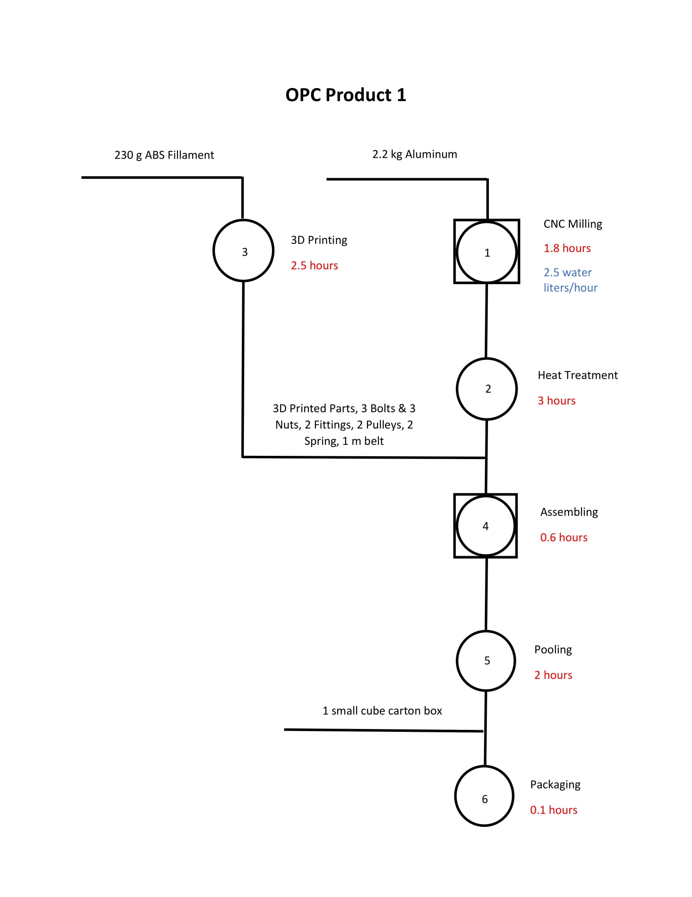
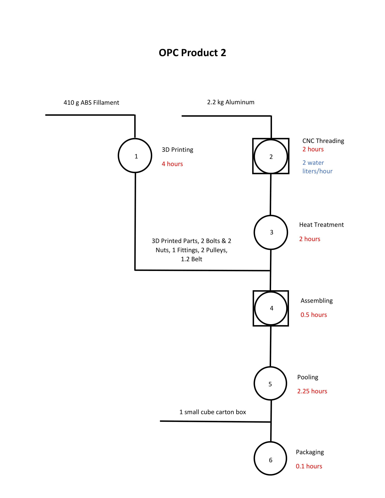
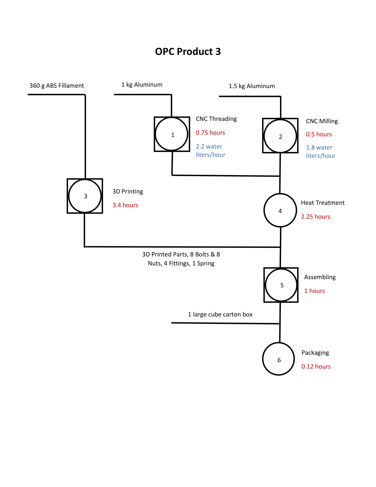
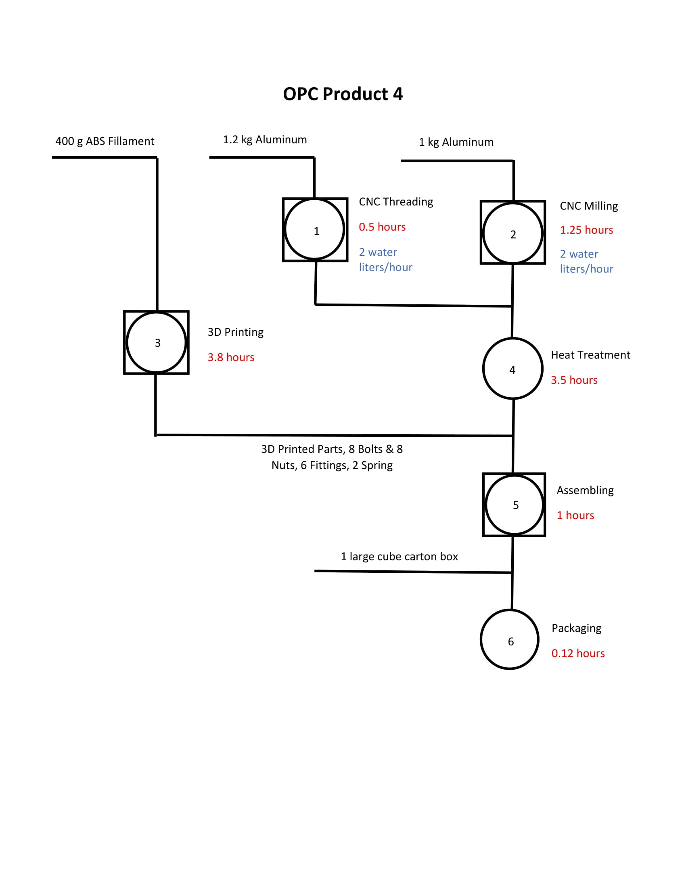

<h1>Production Optimization</h1>
For the final project of the course of 'Operation Research for Strategic Decisions' was asked to define and optimize a real senario problem related to the multi objective problems. The structure of the problem is defined in below.

 

<h2>Problem Structure</h2>

 

A company must start the production of goods on the national territory. The number of goods to be produced for the entire Italian population is represented by integer numbers.

All the following aspects need to be considered:

The procurement of raw materials; production times and costs; the environmental sustainability of the production process; corporate profits. Given this generic scenario, the work involves:

<ol>
<li>Identify a company and a real application scenario, adhering to the general scenario for which to decline the project.</li>
<li>Describe in detail the identified scenario.</li>
<li>Design and implement a mathematical programming model capable of solving the given problem for each single objective.</li>
<li>Solve the problem taking into account the different objectives and constraints.</li>
<li>Calculate the Pareto frontier for the problem. For all objectives simultaneously or for a subset of objectives.</li>
<li>Create several instances to test the developed approaches.</li>
<li>Carry out computational tests starting from the identified test cases.</li>
<li>Comment on the results.</li>
<li>The report describing the work done cannot exceed 10 pages.</li>
</ol>

The project is considered sufficient even if all the required points are not achieved. 
To aim for the highest grade, however, it is necessary to work on all the required points, using both Excel and Python for the various steps.

To do this project the following scenario has defined:

 
    
<h2>Problem Definition</h2>

 

A manufacturing company carried out market research related to the sports training devices.
 

Based on their prediction and abbilities, there are four types of products which could be profitable to produce.

Regarding this research the selling prices, minimum and maximum demands per month are difined in table 1.

<table style="width:50%">
  <tr>
    <th style='text-align: center;'>Products</th>
    <th style='text-align: center;'>Selling Price (Euro)</th>
    <th style='text-align: center;'>Min Demand</th>
    <th style='text-align: center;'>Max Demand</th>
  </tr>
  <tr>
    <td style='text-align: center;'>Product 1</td>
    <td style='text-align: center;'>50</td>
    <td style='text-align: center;'>0</td>
    <td style='text-align: center;'>1000</td>
  </tr>
  <tr>
    <td style='text-align: center;'>Product 2</td>
    <td style='text-align: center;'>50</td>
    <td style='text-align: center;'>0</td>
    <td style='text-align: center;'>1000</td>
  </tr>
  <tr>
    <td style='text-align: center;'>Product 3</td>
    <td style='text-align: center;'>40</td>
    <td style='text-align: center;'>0</td>
    <td style='text-align: center;'>1000</td>
  </tr>
  <tr>
    <td style='text-align: center;'>Product 4</td>
    <td style='text-align: center;'>40</td>
    <td style='text-align: center;'>0</td>
    <td style='text-align: center;'>1000</td>
  </tr>
  <caption style='text-align: center;'>table 1</caption>
</table>

R & D team provides a list of suitable devices for processing these products in table 2. And they reported for every 5 hours processing time by machines (excluding packaging machine) at least required 1 hour labour force only to set-up and configuration machines.

<table style="width:100%">
  <tr>
    <th style='text-align: center;'>Devices</th>
    <th style='text-align: center;'>Price (Euro)</th>
    <th style='text-align: center;'>Electricity Consumption (Wh)</th>
    <th style='text-align: center;'>Monthly Service Cost (Euro)</th>
  </tr>
  <tr>
    <td style='text-align: center;'>CNC 4D Milling Machine + Water System</td>
    <td style='text-align: center;'>3000</td>
    <td style='text-align: center;'>1500</td>
    <td style='text-align: center;'>50</td>
  </tr>
  <tr>
    <td style='text-align: center;'>CNC Threading Machine + Water System</td>
    <td style='text-align: center;'>600</td>
    <td style='text-align: center;'>750</td>
    <td style='text-align: center;'>30</td>
  </tr>
  <tr>
    <td style='text-align: center;'>FDM 3D Printer</td>
    <td style='text-align: center;'>400</td>
    <td style='text-align: center;'>360</td>
    <td style='text-align: center;'>12</td>
  </tr>
  <tr>
    <td style='text-align: center;'>High Temperature Furnace</td>
    <td style='text-align: center;'>600</td>
    <td style='text-align: center;'>2500</td>
    <td style='text-align: center;'>10</td>
  </tr>
  <tr>
    <td style='text-align: center;'>Packaging Machine</td>
    <td style='text-align: center;'>100</td>
    <td style='text-align: center;'>75</td>
    <td style='text-align: center;'>2</td>
  </tr>
  <tr>
    <td style='text-align: center;'>Pooling Lapping Machine</td>
    <td style='text-align: center;'>250</td>
    <td style='text-align: center;'>340</td>
    <td style='text-align: center;'>7</td>
  </tr>
  <caption style='text-align: center;'>table 2</caption>
</table>

The price of raw material are listed in table 3.

<table style="width:40%">
  <tr>
    <th style='text-align: center;'>Raw Material</th>
    <th style='text-align: center;'>Price (Euro)</th>
  </tr>
  <tr>
    <td style='text-align: center;'>Pure Black fillament ABS</td>
    <td style='text-align: center;'>2 Euro / 100 g</td>
  </tr>
  <tr>
    <td style='text-align: center;'>Aluminium</td>
    <td style='text-align: center;'>3 Euro / Kg</td>
  </tr>
  <tr>
    <td style='text-align: center;'>Spring</td>
    <td style='text-align: center;'>0.1</td>
  </tr>
  <tr>
    <td style='text-align: center;'>Bolt</td>
    <td style='text-align: center;'>0.02</td>
  </tr>
  <tr>
    <td style='text-align: center;'>Nuts</td>
    <td style='text-align: center;'>0.025</td>
  </tr>
  <tr>
    <td style='text-align: center;'>Washer</td>
    <td style='text-align: center;'>0.035</td>
  </tr>
  <tr>
    <td style='text-align: center;'>Belt strap</td>
    <td style='text-align: center;'>7 Euro / m</td>
  </tr>
  <tr>
    <td style='text-align: center;'>Fittings</td>
    <td style='text-align: center;'>1</td>
  </tr>
  <tr>
    <td style='text-align: center;'>Pulley</td>
    <td style='text-align: center;'>3.5</td>
  </tr>
  <tr>
    <td style='text-align: center;'>Cube carton box (small)</td>
    <td style='text-align: center;'>0.5</td>
  </tr>
  <tr>
    <td style='text-align: center;'>Cube carton box (large)</td>
    <td style='text-align: center;'>0.7</td>
  </tr>
  <caption style='text-align: center;'>table 3</caption>
</table>

Predefined budget for this investment is maximum 40,000 Euro to buy the devices.

Company needs to know how many devices to buy, how many products of each type to produce per month, how many workers to hire full time to gain the highest profit from this market.

On the other hand, they try to reduce the amount of consumed water to cool the chipping process and respect to the enivornmental sustainability.

This factory works six days per week in 1 shift, and each shift including 8 hours.
 

Salary for each workers is around 1400 Euro per months. And 15% tax should be paid on profit.

Operation Process Chart (OPC) for each products depicted in below.

